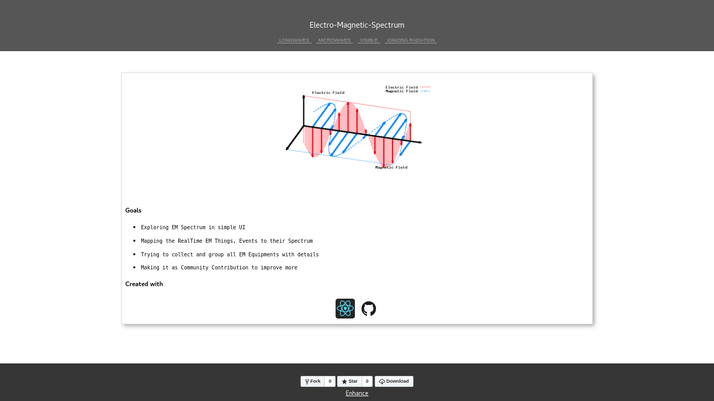

## ElectroMagnetic Spectrum - Demo Application


[Click to view web app](https://bhachauk.github.io/emspectrum)

[](https://bhachauk.github.io/emspectrum)

### Dev note

Install requirements
```dto
npm install
```

Start application using command
```dto
npm start
```

Deploy in gh-pages using command
```dtd
npm run-script deploy
```